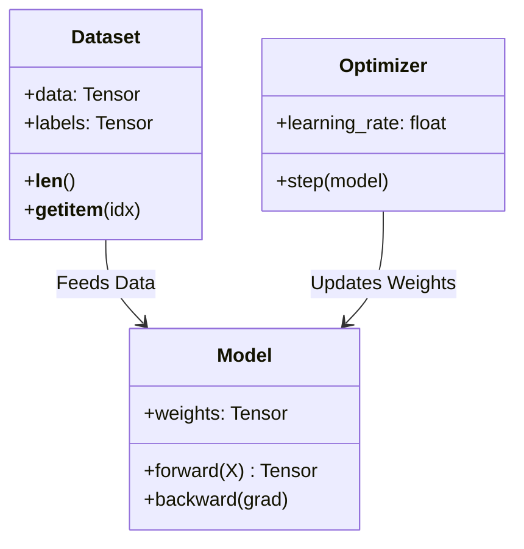

# Module 01: Python for AI Engineering

Welcome to the foundation of AI Engineering. Python is the lingua franca of Machine Learning, not because it is the fastest language, but because it acts as a highly effective "glue" language that interfaces with highly optimized C/C++ and CUDA libraries (like NumPy, PyTorch, and TensorFlow).

To be an effective AI Engineer, you cannot simply write Python scripts; you must understand how Python operates at the hardware and memory level, specifically regarding vectorization, memory contiguousness, and object-oriented architectures.

## Table of Contents
1. [Memory Management & Under the Hood](#1-memory-management--under-the-hood)
2. [The Power of Vectorization](#2-the-power-of-vectorization)
3. [Object-Oriented Programming (OOP) for ML](#3-object-oriented-programming-oop-for-ml)
4. [Real World Use Cases](#4-real-world-use-cases)

---

## 1. Memory Management & Under the Hood

In standard CPython, everything is an object. An integer is not just 4 bytes of memory; it is a full C-struct containing a reference count, type, size, and the value itself. This makes raw Python lists extremely inefficient for mathematical operations because a list is merely an array of pointers to objects scattered across memory.

### Visual Explanation
```mermaid
graph TD
    A[Python List] -->|Pointer| B(Int Object: 5)
    A -->|Pointer| C(Float Object: 3.14)
    A -->|Pointer| D(Int Object: 10)
    
    E[NumPy Array / Tensor] -->|Contiguous Block| F[5 | 3.14 | 10]
```

### Why it matters in AI:
When processing an image (e.g., $1024 \times 1024$ pixels), standard Python loops encounter **cache misses** continuously because memory is fragmented. Modern ML libraries use **contiguous memory blocks** mapped to C-arrays. CPUs and GPUs load contiguous memory into their caches blazing fast via SIMD (Single Instruction, Multiple Data).

---

## 2. The Power of Vectorization

Vectorization is the process of executing operations on entire arrays rather than looping through individual elements. 

### Mathematical Concept
If we have two vectors $A$ and $B$:
$$ A = \begin{bmatrix} a_1 \\ a_2 \\ \vdots \\ a_n \end{bmatrix}, B = \begin{bmatrix} b_1 \\ b_2 \\ \vdots \\ b_n \end{bmatrix} $$

A naive approach computes $C_i = A_i + B_i$ in a loop.
A vectorized approach passes the pointers to $A$ and $B$ to a highly optimized BLAS (Basic Linear Algebra Subprograms) library written in Fortran/C, which computes the addition utilizing parallel CPU registers.

### Manual Implementation vs Library
*See `code/02_vectorization.py` for the code example.*

```python
# Unvectorized (Slow)
c = []
for i in range(len(a)):
    c.append(a[i] * b[i])

# Vectorized (Fast)
import numpy as np
c = np.array(a) * np.array(b)
```

**Library Comparison:**
- **Standard Python:** `O(N)` time complexity in the Python interpreter overhead.
- **NumPy:** Offloads `O(N)` loop to C. Negligible interpreter overhead.
- **PyTorch/TensorFlow:** Offloads `O(N)` loop to GPU cores, achieving extreme parallelism.

---

## 3. Object-Oriented Programming (OOP) for ML

Machine Learning systems are complex. A model is an object. A dataset is an object. A training loop orchestrates interactions between these objects.

### Core ML OOP Architecture


By abstracting components into classes, we ensure that:
1. State (weights, gradients) is encapsulated.
2. Code is reusable (you can swap a `LinearModel` for a `NeuralNetwork` without rewriting the training loop).

*See `code/03_oop_for_ai.py` for a complete implementation.*

---

## 4. Real World Use Cases

* **Healthcare:** Processing 3D MRI scans natively in Python lists would take hours. Vectorized arrays process them in milliseconds, enabling real-time tumor detection.
* **Finance:** High-frequency trading models recalculate risk metrics across millions of trades. OOP architectures allow quantitative developers to hot-swap alpha-generating models dynamically.
* **Manufacturing:** Edge AI devices analyzing factory assembly lines rely on highly optimized C-bindings (like TensorRT) called from Python to execute under strict latency constraints.

---

## Next Steps
1. Navigate to the `code/` directory and run the scripts to benchmark the speed differences yourself.
2. Attempt the assignment in `assignments/01_python_assignment.md`.
3. Verify your work with `solutions/01_python_solution.py`.
